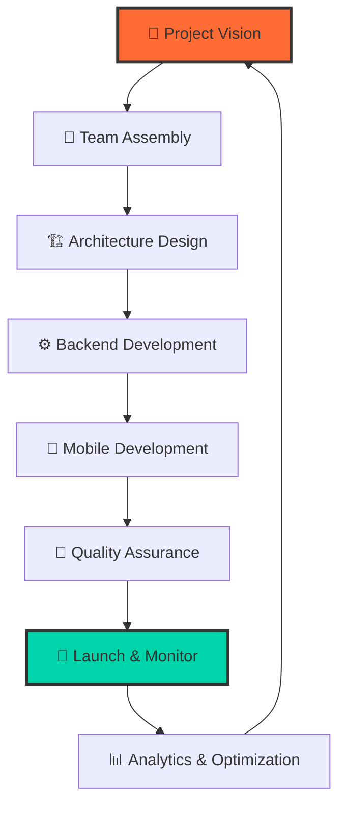

# 🎯 TAHA KHALED - Digital Architect & Innovation Catalyst

<div align="center">

```ascii
████████╗ █████╗ ██╗  ██╗ █████╗     ██╗  ██╗██╗  ██╗ █████╗ ██╗     ███████╗██████╗ 
╚══██╔══╝██╔══██╗██║  ██║██╔══██╗    ██║ ██╔╝██║  ██║██╔══██╗██║     ██╔════╝██╔══██╗
   ██║   ███████║███████║███████║    █████╔╝ ███████║███████║██║     █████╗  ██║  ██║
   ██║   ██╔══██║██╔══██║██╔══██║    ██╔═██╗ ██╔══██║██╔══██║██║     ██╔══╝  ██║  ██║
   ██║   ██║  ██║██║  ██║██║  ██║    ██║  ██╗██║  ██║██║  ██║███████╗███████╗██████╔╝
   ╚═╝   ╚═╝  ╚═╝╚═╝  ╚═╝╚═╝  ╚═╝    ╚═╝  ╚═╝╚═╝  ╚═╝╚═╝  ╚═╝╚══════╝╚══════╝╚═════╝ 
```


### 🚀 **Currently Orchestrating Digital Excellence at Computing Gate** 🚀

</div>

---

## 🎭 **The Mind Behind the Magic**


```yaml
💼 Current Role: "Project Manager @ Computing Gate"
🌍 Location: "Egypt - Where Pyramids Meet Code"
🎯 Mission: "Leading Digital Transformation"
⚡ Superpowers: ["Laravel Mastery", "Flutter Wizardry", "Team Leadership"]
🧬 DNA: "50% Code, 30% Coffee, 20% Pure Innovation"
🎲 Fun Fact: "I debug code faster than I solve Rubik's cubes"
📈 Management Style: "Agile Mind, Adaptive Heart"
```

### 🌟 **What I'm Orchestrating:**
- 🏢 **Leading Projects** at **Computing Gate** - *Where innovation meets execution*
- 📱 **Crafting Mobile Experiences** with Flutter that users fall in love with
- ⚙️ **Architecting Backend Solutions** with Laravel that scale seamlessly  
- 🎯 **Managing Cross-functional Teams** to deliver excellence on time
- 🚀 **Driving Digital Strategy** that transforms business visions into reality

---

## 🏛️ **Computing Gate Empire**

<div align="center">

### 🌐 **Our Digital Presence**
[](https://computinggate.com)

### 📱 **Our App Ecosystem**
[](https://apps.apple.com/eg/developer/computing-gate-company-for-information-technology-one/id1794657621?l=ar)
[](https://play.google.com/store/apps/developer?id=Computing+Gate+For+IT&hl=ar)



</div>

---

## 🛠️ **Tech Arsenal & Command Center**

<div align="center">

### **🎨 Frontend & Mobile Mastery**


### **⚙️ Backend & Server Architecture**


### **📊 Project Management & Collaboration**


### **🗄️ Database & Storage Solutions**


### **🔧 Development & Deployment Tools**


</div>

---

## 🎯 **Leadership Philosophy & Vision**

<div align="center">

> *"Great projects aren't built by great individuals, but by great teams with a shared vision."*

### 🧭 **My Management Principles:**

```
┌─────────────────────────────────────────────────────────┐
│  🎯 VISION-DRIVEN    │  📊 DATA-INFORMED DECISIONS      │
│  🤝 COLLABORATIVE    │  ⚡ AGILE & ADAPTIVE             │
│  🚀 INNOVATION-FIRST │  🎨 USER-CENTRIC APPROACH        │
│  📈 GROWTH-MINDED    │  🔄 CONTINUOUS IMPROVEMENT       │
└─────────────────────────────────────────────────────────┘
```

</div>

---

## 🌐 **Connect & Collaborate**

<div align="center">

### **📞 Let's Build Something Amazing Together**

[](https://eg.linkedin.com/in/taha-khaled-ba7090251)
[](mailto:tahakhaled419@gmail.com)
[](https://wa.me/20113051656)

### **🎯 Open for:**
- 💼 **Project Collaborations** - *Let's create digital masterpieces*
- 🚀 **Tech Consultations** - *Laravel & Flutter expertise at your service*
- 🤝 **Partnership Opportunities** - *Building the future together*
- 📞 **Direct Contact:** `+20113051656`

</div>

---

## 🏆 **Achievement Unlocked**

<div align="center">

| 🎖️ Milestone | 📅 Timeline | 🎯 Impact |
|--------------|-------------|-----------|
| 🚀 **Project Manager @ Computing Gate** | 2024 - Present | Leading digital innovation |
| 📱 **Mobile App Portfolio** | Multi-year | Apps on both iOS & Android |
| ⚙️ **Backend Architecture** | Continuous | Scalable Laravel solutions |
| 👥 **Team Leadership** | Ongoing | Empowering development teams |

</div>

---

## 🎨 **Creative Code Gallery**

<div align="center">

```php
<?php
// My approach to problem-solving
class TahaKhaled {
    private $role = "Project Manager & Full-Stack Developer";
    private $company = "Computing Gate";
    private $passions = ["Laravel", "Flutter", "Team Leadership"];
    
    public function solveProblems($challenge) {
        $solution = $this->analyze($challenge)
                        ->architect()
                        ->implement()
                        ->test()
                        ->optimize();
        
        return $solution->deliverExcellence();
    }
    
    public function leadTeam($project) {
        return $this->inspire()
                   ->collaborate()
                   ->innovate()
                   ->achieve();
    }
}
```

</div>

---

## 📈 **Current Mission Status**

<div align="center">


### **🎯 2025 Objectives:**

```
▓▓▓▓▓▓▓▓▓░ 90% - Scale Computing Gate Projects
▓▓▓▓▓▓▓▓░░ 80% - Expand Flutter Expertise  
▓▓▓▓▓▓▓░░░ 70% - Leadership Development
▓▓▓▓▓▓░░░░ 60% - Open Source Contributions
```

</div>

---

<div align="center">

### 🌟 **"Code is my language, Innovation is my dialect, Leadership is my superpower"** 🌟

```
╔══════════════════════════════════════════════════════╗
║  🏢 Computing Gate • 📱 Flutter • ⚙️ Laravel       ║
║  🇪🇬 Made in Egypt • 🚀 Deployed Globally          ║
╚══════════════════════════════════════════════════════╝
```

*Architecting Tomorrow's Digital Solutions Today | © 2024*

</div>
